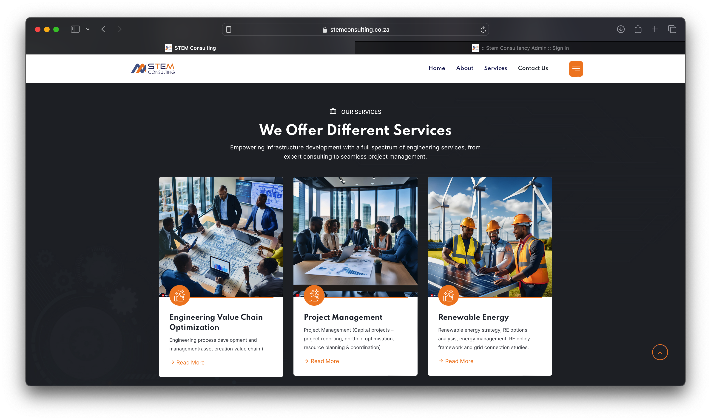
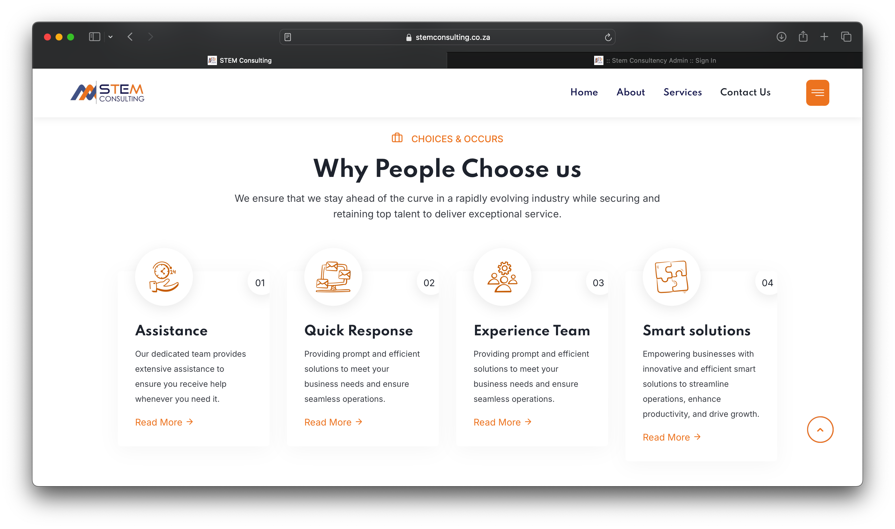
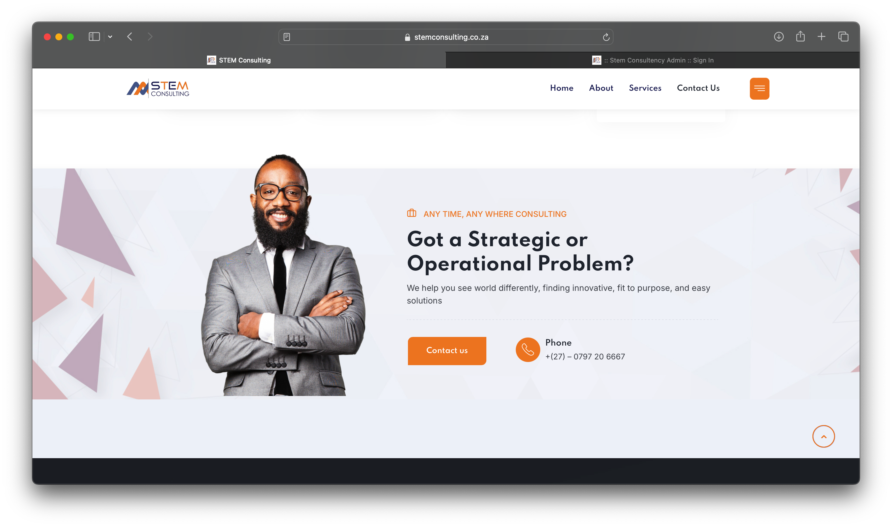
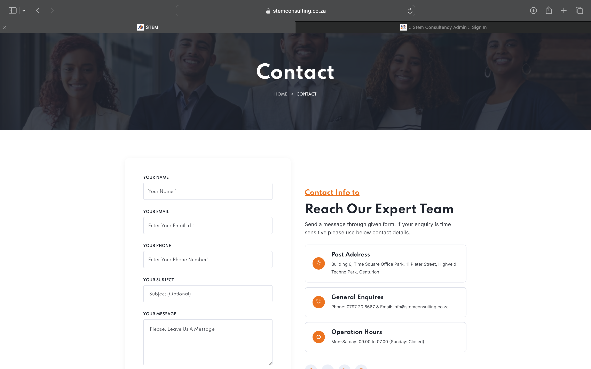
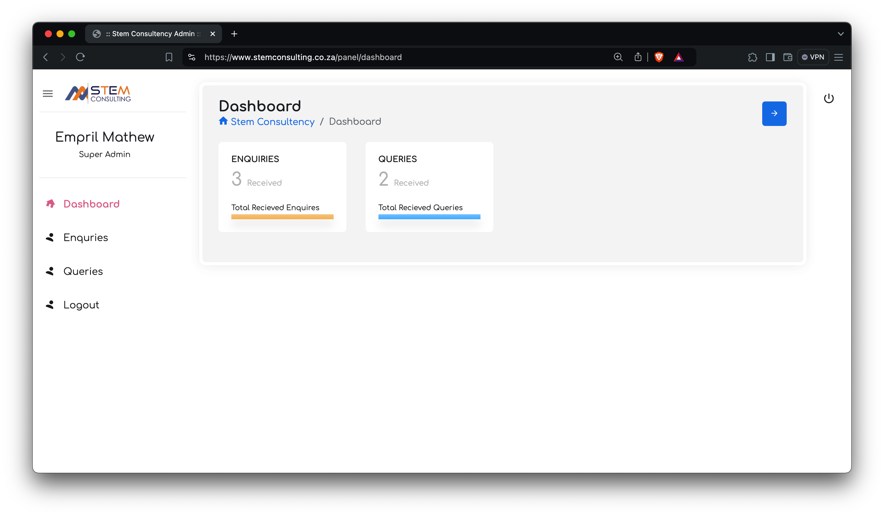
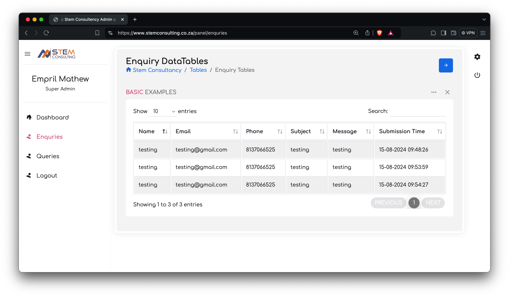
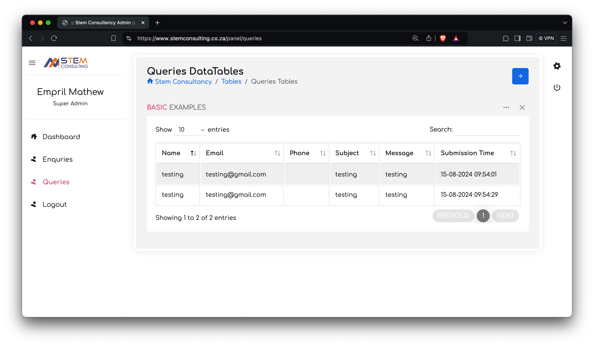

# STEM CONSULTANCY (BUSSINESS WEBSITE). 🚀 MYSQL DATABASE 💻

🚀 MySQL Database Services 💻

Unlock the full potential of your data with our cutting-edge MySQL database solutions.
## Project Overview

Our MySQL Database Services project provides a comprehensive solution for businesses seeking to leverage the power of MySQL. From designing efficient databases to integrating them with existing systems and ensuring ongoing performance optimization, our services cover the entire spectrum of database management.
## Features

- Database Design: Tools and templates for creating scalable and efficient database schemas.
- Optimization: Scripts for analyzing and optimizing database performance.
- Backup & Recovery: Automated scripts to ensure data integrity with regular backups.
- Maintenance: Automated maintenance scripts to keep your database running smoothly.

## Screenshots

